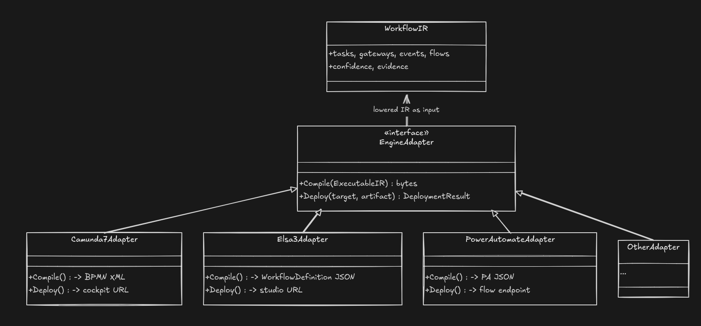
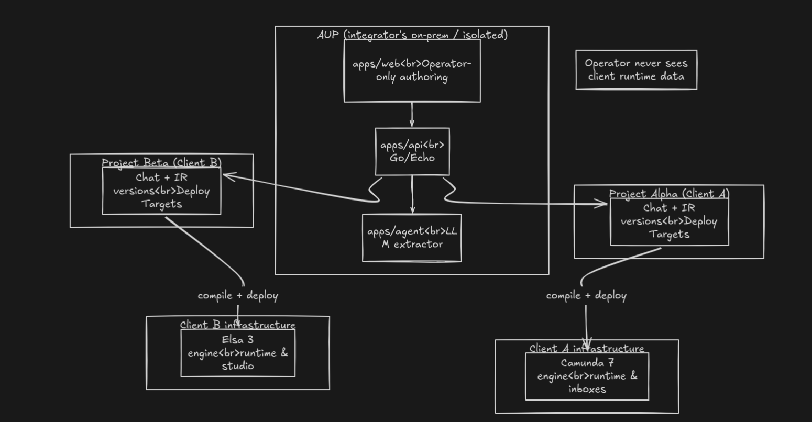
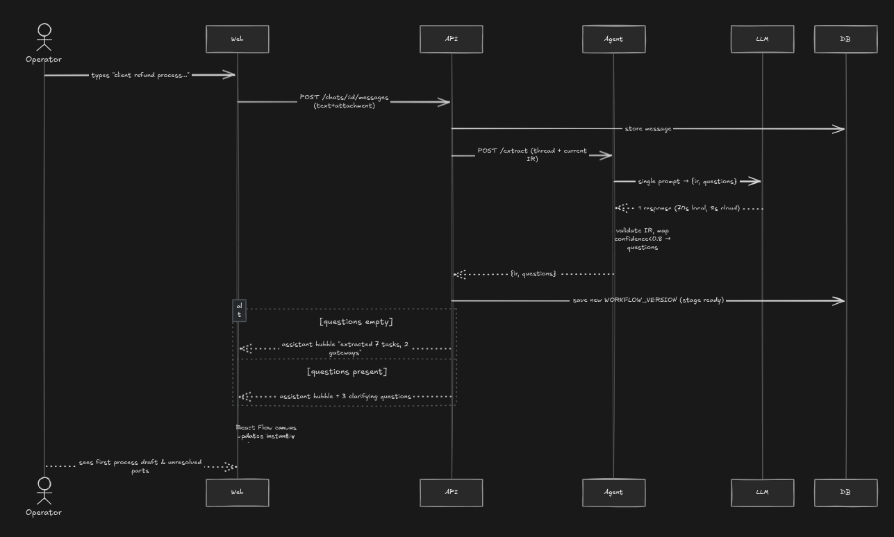
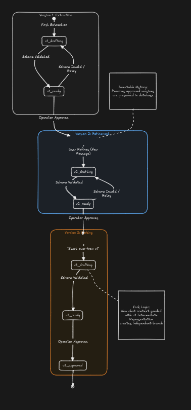
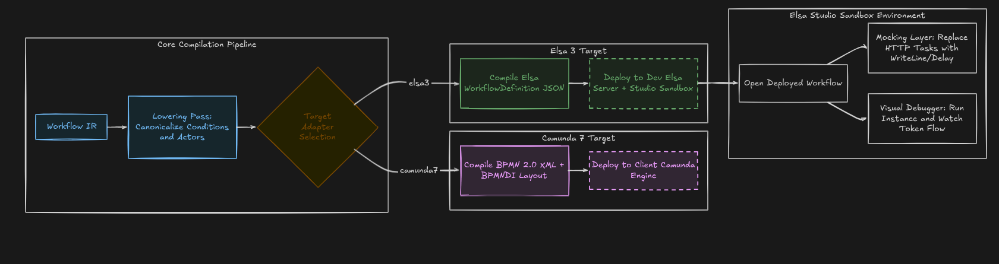
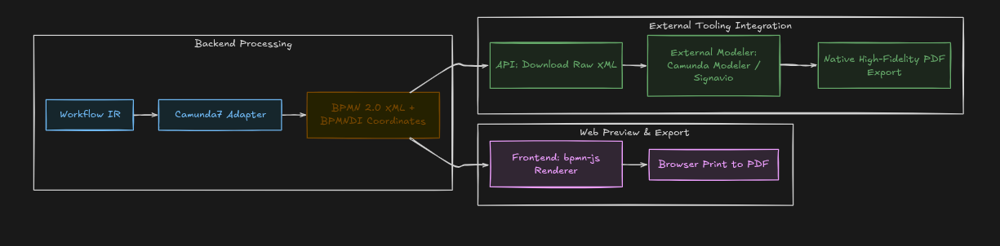

# Pablo Diagrams

These are static renders of the system diagrams so they display directly in
Markdown. The HTML versions remain available for full-page viewing.

## Architecture

[Open full architecture diagram](architecture.html)

## User Flow

[Open full user-flow diagram](flowchart.html)

## Compilation Pipeline

[Open full compilation diagram](compilation-layers.html)

## Data Model

[Open full data-model diagram](data-model.html)

## Runtime Visibility

## Compact Pipeline

